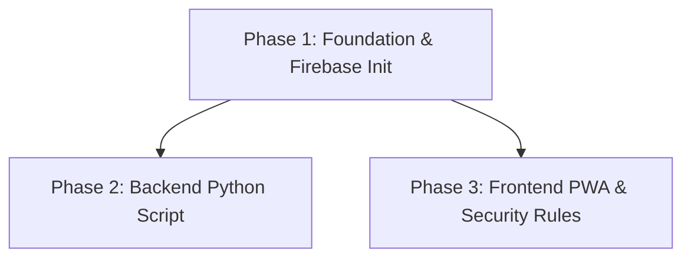

# Implementation Plan: Tracker Financiero Automatizado

## 1. Plan Overview
- Total phases: 3
- Agents involved: devops_engineer, coder
- Estimated effort: Medium
- Execution Profile:
  - Total phases: 3
  - Parallelizable phases: 2 (in 1 batches)
  - Sequential-only phases: 1

## 2. Dependency Graph

## 3. Execution Strategy Table
| Phase | Name | Agent | Mode | Blocked By |
|---|---|---|---|---|
| 1 | Foundation & Firebase Init | devops_engineer | Sequential | - |
| 2 | Backend Python Script | coder | Parallel | 1 |
| 3 | Frontend PWA & Security Rules | coder | Parallel | 1 |

## 4. Phase Details

### Phase 1: Foundation & Firebase Init
- **Objective:** Scaffold Vite app, setup tracker-backend folder, configure Firebase.
- **Agent:** devops_engineer
- **Files to Create:**
  - `tracker-backend/requirements.txt`: Python deps (firebase-admin, python-dotenv).
  - `tracker-backend/.env.example`: Env vars template.
  - `tracker-backend/prompt.md`: Base prompt for Gemini.
  - `firebase.json`: Hosting config pointing to `dist/`.
- **Files to Modify:**
  - `.gitignore`: Add `.env`, `serviceAccountKey.json`, `tracker-backend/.venv/`.
- **Validation:** Run `npm create vite@latest . -- --template react-ts` (or similar) and verify folders exist.

### Phase 2: Backend Python Script
- **Objective:** Read from Gmail, parse with Gemini, write to Firestore.
- **Agent:** coder
- **Files to Create:**
  - `tracker-backend/main.py`: Core logic with `db.transaction()` for huchas.
- **Validation:** `python -m py_compile tracker-backend/main.py`
- **Dependencies:** `blocked_by: [1]`

### Phase 3: Frontend PWA & Security Rules
- **Objective:** React Dashboard, Recharts, Firebase Auth, Firestore Rules.
- **Agent:** coder
- **Files to Create:**
  - `firestore.rules`: Security rules.
  - `public/manifest.json`: PWA manifest.
- **Files to Modify:**
  - `src/App.tsx`: Main dashboard UI.
- **Validation:** `npm run build`
- **Dependencies:** `blocked_by: [1]`

## 5. File Inventory
| File | Phase | Purpose |
|---|---|---|
| `tracker-backend/requirements.txt` | 1 | Backend deps |
| `tracker-backend/.env.example` | 1 | Env template |
| `tracker-backend/prompt.md` | 1 | Gemini prompt |
| `.gitignore` | 1 | Security exclusions |
| `firebase.json` | 1 | Firebase config |
| `tracker-backend/main.py` | 2 | Core backend logic |
| `firestore.rules` | 3 | Security rules |
| `public/manifest.json` | 3 | PWA manifest |
| `src/App.tsx` | 3 | Dashboard UI |

## 6. Risk Classification
- Phase 1: LOW (Basic scaffolding)
- Phase 2: HIGH (Firestore transaction logic requires precision)
- Phase 3: MEDIUM (PWA config and rules)

## 7. Cost Estimation
| Phase | Agent | Model | Est. Input | Est. Output | Est. Cost |
|-------|-------|-------|-----------|------------|----------|
| 1 | devops_engineer | Pro | 500 | 400 | $0.02 |
| 2 | coder | Pro | 1000 | 600 | $0.03 |
| 3 | coder | Pro | 1000 | 800 | $0.04 |
| **Total** | | | **2500** | **1800** | **$0.09** |
