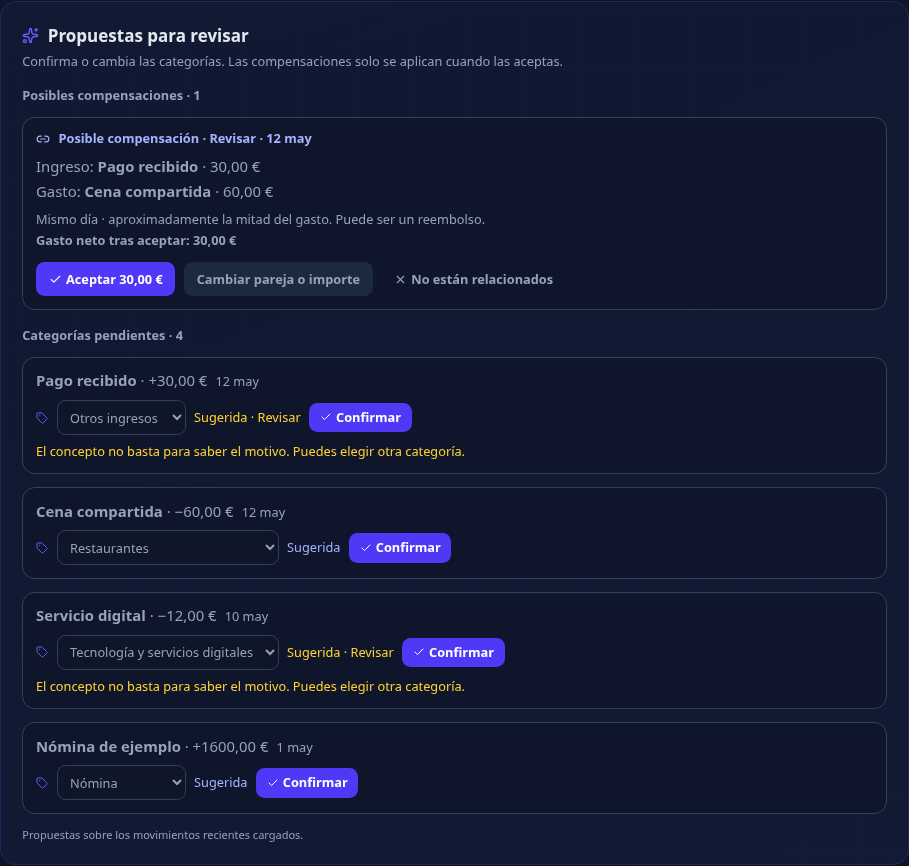
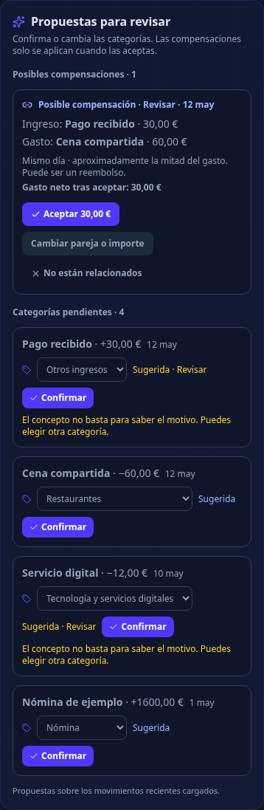

# Propuestas de categorías y compensaciones

En el panel de actividad, **Propuestas para revisar** muestra categorías pendientes y posibles compensaciones. Cada categoría tiene un selector: **Confirmar** acepta la propuesta; elegir otra categoría la guarda directamente. Las propuestas menos claras indican **Revisar**. Seleccionar **Sin categorizar** también es una decisión confirmada. Las categorías confirmadas no se sustituyen por propuestas automáticas.

El histórico también permite confirmar o corregir categorías de movimientos antiguos.

El filtro **Categoría** permite encontrar movimientos de un tipo o los pendientes de confirmar. El CSV distingue las categorías confirmadas de las propuestas. Los movimientos anteriores al cambio reciben propuestas por comercio o concepto al abrir la aplicación, sin modificar su información guardada.

Los nuevos correos procesados con Gemini incluyen una categoría propuesta y su confianza, independiente de la confianza en la extracción del importe o del tipo de movimiento. Los conceptos ambiguos, nombres de personas o servicios digitales genéricos reciben propuestas amplias para revisar. Los Bizum salientes con un motivo explícito de gasto se pueden extraer; se siguen excluyendo recargas, transferencias internas y avisos no confirmados.

## Compensaciones

Se comparan ingresos y gastos del mismo día de calendario en **Europe/Madrid**, tanto antes como después del cargo. Se proponen importes iguales o próximos a repartos habituales (mitad, tercio, cuarto, dos tercios y tres cuartos), con tolerancia de hasta un euro y sin superar nunca el gasto disponible. Un concepto explícito de reembolso también permite sugerir otros importes parciales compatibles. Una coincidencia es una propuesta, no una prueba; si hay varios gastos compatibles, se muestra la duda.

- **Aceptar** vincula el ingreso al gasto por el importe mostrado y actualiza el gasto neto.
- **Cambiar pareja o importe** abre el editor de compensaciones existente.
- **No están relacionados** guarda el rechazo para esa pareja y permite buscar otras candidatas.
- El botón de desvinculación del movimiento permite deshacer la compensación, también en demo.

Aceptar y deshacer no alteran los saldos de las carteras: el dinero ya fue registrado. Los resúmenes usan el gasto neto y la parte del ingreso que no se ha asignado a una compensación. Las transacciones releen los documentos y validan propietario, tipos, céntimos e importes disponibles antes de guardar ambos lados. Los movimientos internos, nóminas explícitas, parejas ya vinculadas o descartadas no se proponen.

El panel trabaja con los movimientos recientes cargados (actualmente hasta 150). No garantiza encontrar una pareja que haya quedado fuera de esa ventana. El rechazo afecta a una pareja concreta, no a todas las operaciones futuras de una persona.

## Despliegue

1. Desplegar las reglas actualizadas de `firestore.rules`, que admiten y validan los campos de categoría y descartes.
2. Publicar el frontend compilado.
3. Actualizar el sincronizador incluyendo `category_suggestions.py` y `prompts/categories.json`, junto con el resto de `tracker-backend/`. El esquema y el prompt editable siguen en `prompts/`.

No se necesita una migración de movimientos. El catálogo compartido está en `tracker-backend/prompts/categories.json`; si se amplía, hay que mantener también la lista de categorías permitidas en las reglas y volver a desplegarlas. La clasificación real de Gemini depende del modelo configurado y debe contrastarse con ejemplos revisados; las pruebas locales validan contratos y flujos, sin llamar a Gmail, Gemini ni Firestore de producción.

## Capturas con datos ficticios

